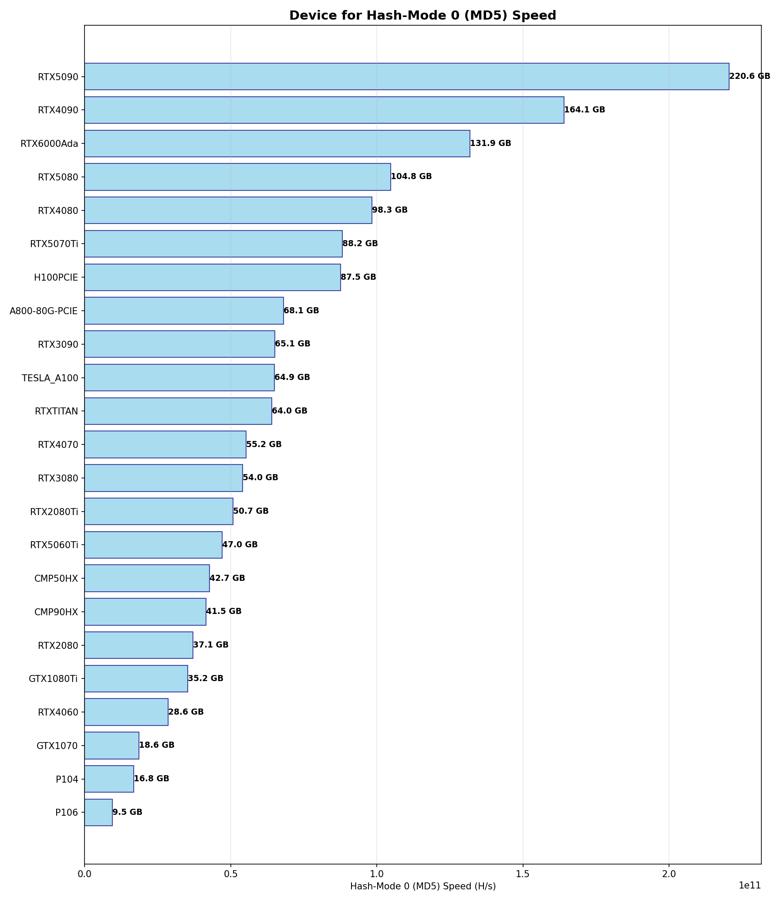

# Hashcat Grighpic Benchmark Dataset

This project collects and displays Hashcat benchmark results on the almost GPU. You can find detailed benchmark output in the file `benchmarks/etc..`

## Visualization

You can use the scripts in this project to visualize the benchmark results. Example image below:



## Custom Visualization

You can visit the [online visualization page](https://dosoos.github.io/hashcat_speeds/pages/index.html) to customize the hash type and view speed rankings and comparison charts.

This page supports filtering and sorting by various Hash-Modes, making it easy to compare the performance of different GPUs on different algorithms.

## How to Add Your Benchmark Text

1. **Prepare Your Benchmark Results**  
   Run the Hashcat benchmark, for example:
   ```
   hashcat -b --benchmark-all > benchmarks/YourGPUModel.txt
   ```
   This will save the benchmark results to the `benchmarks` folder.

2. **Naming Convention**  
   Please use your GPU model as the filename, such as: `RTX4090.txt`, `A100.txt`, etc.

3. **Submit Your Data**  
   Add your benchmark text file to the `benchmarks/` directory and submit it via a Pull Request.

> If you have new benchmark data, contributions are welcome!

