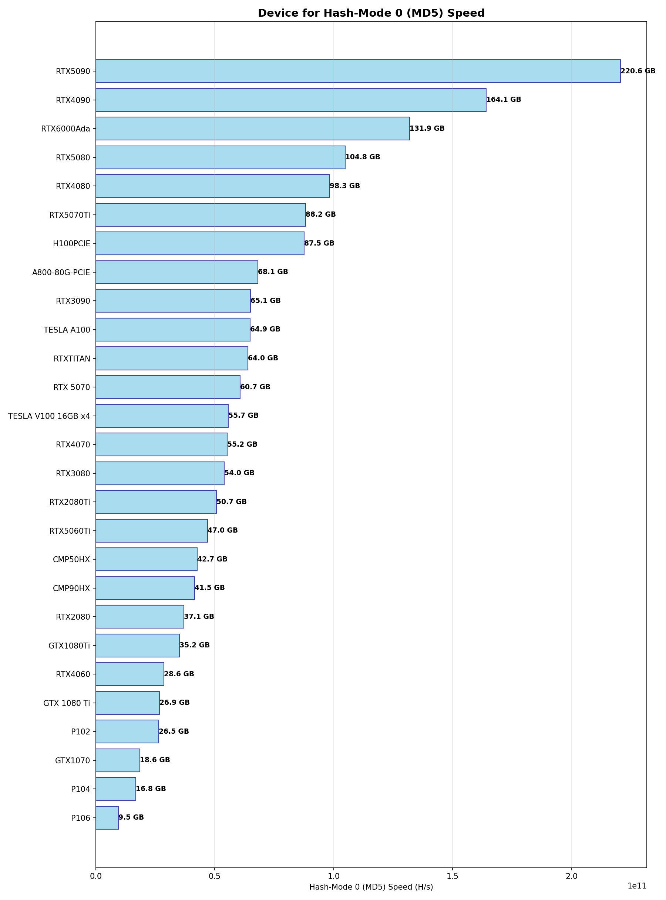

# Hashcat Grighpic Benchmark Dataset

This project collects and displays Hashcat benchmark results on the almost GPU. You can find detailed benchmark output in the file `benchmarks/etc..`

## Visualization

You can use the scripts in this project to visualize the benchmark results. Example image below:



## Custom Visualization

You can visit the [online visualization page](https://dosoos.github.io/hashcat_speeds/pages/index.html) to customize the hash type and view speed rankings and comparison charts.

This page supports filtering and sorting by various Hash-Modes, making it easy to compare the performance of different GPUs on different algorithms.

## How to Add Your Benchmark Results

1. Run the benchmark and copy the output:
   ```
   hashcat -b
   ```
2. Open the [online visualization page](https://dosoos.github.io/hashcat_speeds/pages/index.html)
   and click **Submit Benchmark**.
3. Paste the full benchmark output and complete the captcha.
4. Click **Submit**. The output is validated in a [Cloudflare Worker](worker/),
   the GPU model is auto-detected, and the result is committed to `benchmarks/`
   as `<Model>_<timestamp>.txt` (e.g.
   `NVIDIA_GeForce_RTX_4090_2026-08-12T14-30-45.123.txt`). The GitHub Action
   then automatically regenerates `pages/datas.json` and the charts.

The submit button only appears once the page has been configured with a worker
URL (see [worker/README.md](worker/README.md) for deployment).
